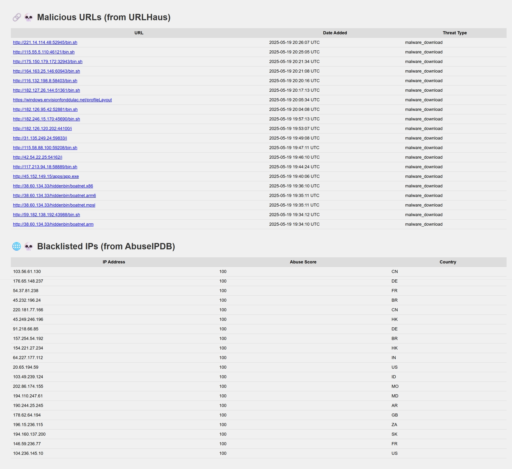

🛡️ Threat Feed Aggregator

A simple Flask-based web application that aggregates and displays real-time threat intelligence data from public sources like **AbuseIPDB** (malicious IPs) and **URLHaus** (malicious URLs). This project demonstrates how to collect, process, and visualize IOCs (Indicators of Compromise) in a centralized dashboard.

📌 Features

 ✅ Live data fetch from AbuseIPDB using API key
 ✅ Reliable URLHaus feed via daily JSON dump
 ✅ Displays top 20 blacklisted IP addresses with abuse scores and country codes
 ✅ Displays recent malicious URLs with threat types and timestamps
 ✅ Basic HTML frontend with clean tabular layout
 ✅ Uses environment variables for secure API key storage

🔧 Tech Stack

* Python 3
* Flask– Web server
* Jinja2 – Template rendering
* Requests – API consumption
* dotenv – Environment variable loading

 📂 Project Structure

threat-feed-aggregator/
│
├── app.py                  # Main Flask application
├── .env                    # Contains AbuseIPDB API key
├── requirements.txt        # Python dependencies
└── templates/
    └── index.html          # HTML frontend template

🔐 Environment Setup

Create a .env file in the root directory:
.env
ABUSE_API_KEY=your_actual_api_key_here

▶️ Running the App
bash
# Create and activate virtual environment (optional)
python -m venv venv
venv\Scripts\activate        # Windows
source venv/bin/activate     # macOS/Linux

Install dependencies
pip install -r requirements.txt

# Run the app
python app.py

Open your browser at: [http://127.0.0.1:5000](http://127.0.0.1:5000)

 💡 Future Improvements

* IOC export to CSV/JSON
* Filtering by country or threat type
* Pagination or search bar
* Additional threat feeds (AlienVault OTX, VirusTotal, etc.)
